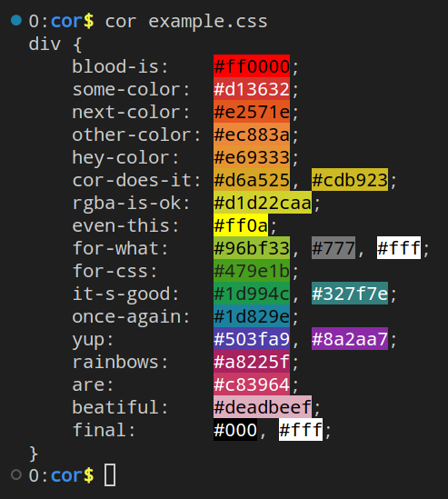

`cor` is similar to the [`cat` command][cat], but outputs the file contents with colored [hexadecimal triplets][hex] (e.g. #f00 with a red background).

## Build instructions

  ```bash
  make
  ```

## How it works?

Using a terminal supporting ["true color"][tc], it is possible to use these [ANSI escape sequences][esc]:

    ESC[38;2;⟨r⟩;⟨g⟩;⟨b⟩m Select RGB foreground color
    ESC[48;2;⟨r⟩;⟨g⟩;⟨b⟩m Select RGB background color

In practice, this means that you can show the text 'TRUECOLOR' in orange in your terminal supporting "true color" this way:

  ```bash
  printf '\033[38;2;255;100;0m%s\033[0m\n' TRUECOLOR
  ```

## See also

- ```bash
  cor --help
  ```

- [ap/vim-css-color][vim-plugin]: A Vim plugin to preview colors in source code while editing.
  - The inspiration for `cor` (which, by the way, means color in Portuguese)

[cat]: https://en.wikipedia.org/wiki/Cat_(Unix)
[hex]: https://en.wikipedia.org/wiki/Web_colors#Hex_triplet
[tc]: https://en.wikipedia.org/wiki/ANSI_escape_code#24-bit
[esc]: https://en.wikipedia.org/wiki/ANSI_escape_code
[vim-plugin]: https://github.com/ap/vim-css-color
